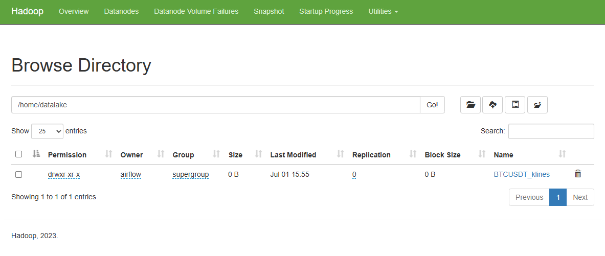

# Getting Crypto BTC-UST K-lines from Cryptocurrency Exchange with Apache Airflow and Spark.

Using airflow to schedule spark jobs to run daily to get data about K-lines of BTC-USDT from 3 exchanges Binance, Bybit and BingX.


### Project Structure

The DAG sparking_flow includes the following tasks:

* start: A PythonOperator that prints "Jobs started".
* fetch_binance: A SparkSubmitOperator that submits a Python Spark job to get data from Binance.
* fetch_bybit:  A SparkSubmitOperator that submits a Python Spark job to get data from Bybit.
* fetch_bingX:  A SparkSubmitOperator that submits a Python Spark job to get data from BingX.
* end: A PythonOperator that prints "Jobs completed successfully".

These tasks are executed in a sequence where the start task triggers the Spark jobs in parallel, and upon their completion, the end task is executed.

### Prerequisites

Before setting up the project, ensure you have the following:

* Docker and Docker Compose 
* Apache Airflow Docker image.
* Apache Spark Docker image and configured to work with Airflow.
* Apache Hadoop Docker image.
* Docker volumes for Airflow DAGs, logs, and Spark jobs are properly set up.

These tasks are executed in a sequence where the start task triggers the Spark jobs in parallel, and upon their completion, the end task is executed.


### Installation

To run this project using Docker, follow command:

```
$ docker-compose up -d
```

## Check if you can access

Airflow: http://localhost:8080
* username: airflow
* password: airflow

Spark Master: http://localhost:9090

Postgres - Database airflow: http://localhost:5432
* Database: airflow
* User: airflow
* Password: airflow

Hadoop HDFS
* Namnode: http://localhost:9870
* Resource manager: http://localhost:8088

### How to run a DAG to test

1. Configure spark connection acessing airflow web UI http://localhost:8080 and going to Connections


2. Add Spark and Telegram connection:


Variable for telegram connection


3. Run DAG:


Failure situation -> notify to telegram:


4. Check the spark application in the Spark Master web UI (http://localhost:9090)


5. Check datalake (HDFS)




