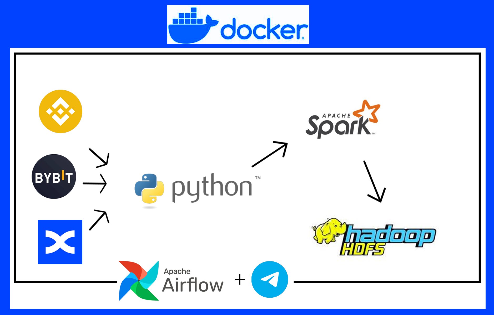
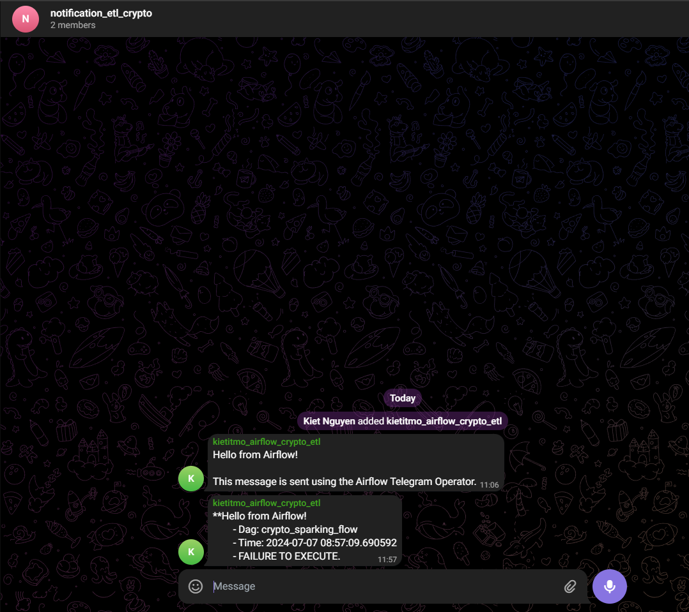
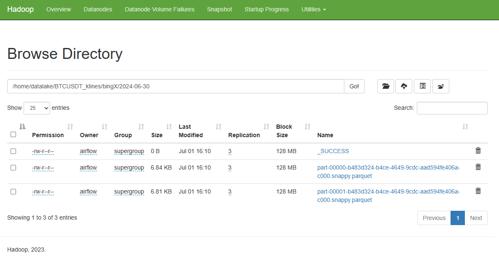

# Getting Crypto BTC-UST K-lines from Cryptocurrency Exchange with Apache Airflow and Spark.

Using airflow to schedule spark jobs to run daily to get data about K-lines of BTC-USDT from 3 exchanges Binance, Bybit and BingX.



### Project Structure

The DAG sparking_flow includes the following tasks:

* start: A PythonOperator that prints "Jobs started".
* fetch_binance: A SparkSubmitOperator that submits a Python Spark job to get data from Binance.
* fetch_bybit:  A SparkSubmitOperator that submits a Python Spark job to get data from Bybit.
* fetch_bingX:  A SparkSubmitOperator that submits a Python Spark job to get data from BingX.
* end: A PythonOperator that prints "Jobs completed successfully".

These tasks are executed in a sequence where the start task triggers the Spark jobs in parallel, and upon their completion, the end task is executed.

### Prerequisites

Before setting up the project, ensure you have the following:

* Docker and Docker Compose 
* Apache Airflow Docker image.
* Apache Spark Docker image and configured to work with Airflow.
* Apache Hadoop Docker image.
* Docker volumes for Airflow DAGs, logs, and Spark jobs are properly set up.

These tasks are executed in a sequence where the start task triggers the Spark jobs in parallel, and upon their completion, the end task is executed.


### Installation

To run this project using Docker, follow command:

```
$ docker-compose up -d
```

## Check if you can access

Airflow: http://localhost:8080
* username: airflow
* password: airflow

Spark Master: http://localhost:9090

Postgres - Database airflow: http://localhost:5432
* Database: airflow
* User: airflow
* Password: airflow

Hadoop HDFS
* Namnode: http://localhost:9870
* Resource manager: http://localhost:8088

API response example: 

* Binance:

```
[
  [
    1591258320000,          // Open time
    "9640.7",               // Open
    "9642.4",               // High
    "9640.6",               // Low
    "9642.0",               // Close (or latest price)
    "206",                  // Volume
    1591258379999,          // Close time
    "2.13660389",           // Base asset volume
    48,                     // Number of trades
    "119",                  // Taker buy volume
    "1.23424865",           // Taker buy base asset volume
    "0"                     // Ignore.
  ]
]
```

[Binane api document](https://developers.binance.com/docs/derivatives/coin-margined-futures/market-data/Kline-Candlestick-Data)

* Bybit:
```
{
    "retCode": 0,
    "retMsg": "OK",
    "result": {
        "symbol": "BTCUSD",
        "category": "inverse",
        "list": [
            [
                "1670608800000",
                "17071",
                "17073",
                "17027",
                "17055.5",
                "268611",
                "15.74462667"
            ],
            [
                "1670605200000",
                "17071.5",
                "17071.5",
                "17061",
                "17071",
                "4177",
                "0.24469757"
            ],
            [
                "1670601600000",
                "17086.5",
                "17088",
                "16978",
                "17071.5",
                "6356",
                "0.37288112"
            ]
        ]
    },
    "retExtInfo": {},
    "time": 1672025956592
}
```

[Bybit api document](https://bybit-exchange.github.io/docs/v5/market/kline)

* BingX:

```
{
  "open": "float64",
  "close": "float64",
  "high": "float64",
  "low": "float64",
  "volume": "float64",
  "time": "int64"
}
```

[BingX api document](https://bingx-api.github.io/docs/#/en-us/swapV2/market-api.html#Kline/Candlestick%20Data)


### How to run a DAG to test

1. Configure spark connection acessing airflow web UI http://localhost:8080 and going to Connections


2. Add Spark and Telegram connection:


Variable for telegram connection


3. Run DAG:


Failure situation -> notify to telegram:




4. Check the spark application in the Spark Master web UI (http://localhost:9090)


5. Check datalake (HDFS)





